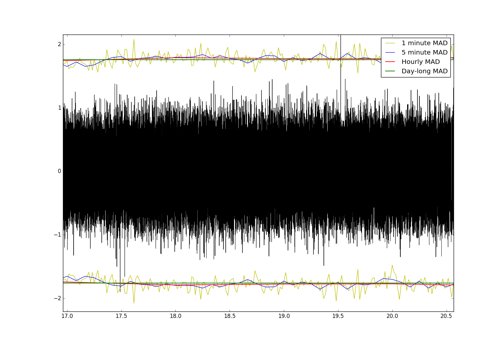

Core
====

Core routines of the EQcorrscan project.  These routines concern the
large-scale matched-filter detection of near-repeating earthquakes.  For
this to take place a series of templates must be generated: these templates can
be created using the functions in **template_gen**, or you can generate them
externally.  Templates in EQcorrscan are simply cut waveforms.  Because
EQcorrscan relies on Obspy_, these waveforms can be any
type readable by Obspy.  For simplicity, portability and data compression
reasons, EQcorrscan currently stores templates on-disk as multiplexed
miniseed files, where each file is a single template.

.. _Obspy: http://docs.obspy.org/

Brightness
----------
bright_lights_ contains a series of functions to detect events using the
brightness-based beamforming method of `Frank et. al (2014)`_.  This has been
tested significantly, but has failed to detect events unambiguously in the
central Southern Alps.  As such development of these functions has ceased.

.. _bright_lights: submodules/core.bright_lights.html
.. _Frank et. al (2014): http://gji.oxfordjournals.org/content/197/2/1215.short

Template generation
-------------------
template_gen_ contains routines for cutting waveforms around picks for use as
templates in match_filter_.  Included in this are wrappers to directly read in
Seisan formattaed pick files and waveforms associated with the picks, and
generate templates from these.  There are also wrappers for quakeML events
and catalogs, and seishub databases.

.. _template_gen: submodules/core.template_gen.html

Matched-Filter
--------------
match_filter_ contains the core routines for earthquake detection by
cross-correlation.  This is optimized for large-scale, multi-paralleled
detection, with large numbers of templates.  Because we are unsure of your
architecture we have not written functions for the top level of possible
parallel computing, which would be to compute detections for multiple days
in parallel in a High-Performance Computing, cluster environment.  If you
want to know more about doing this please contact the authors.  We use
a cluster running SLURM for job scheduling and handle multiple days using
the batch job submission capability which distributes daily detections across
multiple nodes.  This allows us to detect earthquakes through > 6 years of
multi-channel data using > 600 templates in less than 36 hours.

Of note: EQcorrscan does not enforce a length of data to process, it is up to the
user to exercise caution when thresholding cross-correlation sums.  As the figure
below shows, if using the median absolute deviation (MAD) thresholding metric
the user should be aware that this changes with time, and those variations
can be significant when using short windows of data.

     Plot of a few hours of cross-correlation sum (black) for a five channel template
     associated with the Parkfield 2004 earthquake with various windowed thresholds,
     set to 8 x Median Absolute Deviation. x-axis is time in hours, y-axis is
     cross-correlation sum.

.. _match_filter: submodules/core.match_filter.html

Lag-Calc
--------
lag_calc_ contains functions for generating pick-corrections from
cross-correlations with a defined template.  Originally this was designed
for events detected by match_filter_, however you can use any well correlated
events.  Based on the method of `Shelly and Hardebeck (2010)`_.

.. _lag_calc: submodules/core.lag_calc.html
.. _Shelly and Hardebeck (2010): http://onlinelibrary.wiley.com/doi/10.1029/2010GL043672/full

Subspace
--------
subspace_ contains a subspace detector for either single-channel cases, or
network cases.  This is modelled on that described by Harris_.  This method
allows for slightly more variation in detected waveforms than the traditional
matched-filter method.  In this method, templates are constructed either by
using the empirical subspace method, or by computing the basis vectors by
singular-value decomposition.  Both methods are provided as part of EQcorrscan
in the clustering_ module.

.. _subspace: submodules/core.subspace.html
.. _Harris: https://e-reports-ext.llnl.gov/pdf/335299.pdf
.. _clustering: submodules/utils.clustering.html

