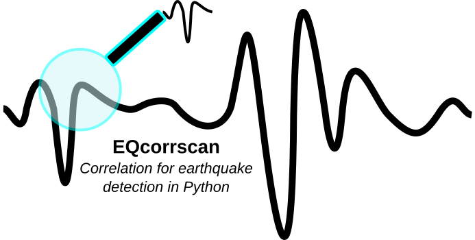

EQcorrscan
==========

A Python package for the detection and analysis of repeating and near-repeating seismicity.
EQcorrscan contains an efficient, multi-parallel,
:doc:`matched-filter </submodules/core.match_filter>` detection routine, as well as
routines to implement :doc:`subspace </submodules/core.subspace>` detection,
and detection based on :doc:`brightness </submodules/core.bright_lights>`.

Code is stored on |github|, the development branches are |github_dev|, or the
latest stable release can be found |releases_link|.

.. |github| raw:: html

    <a href="https://github.com/eqcorrscan/EQcorrscan" target="_blank">github</a>

.. |releases_link| raw:: html

  <a href="https://github.com/eqcorrscan/EQcorrscan/releases" target="_blank">here</a>

.. |github_dev| raw:: html

  <a href="https://github.com/eqcorrscan/EQcorrscan/tree/develop" target="_blank">here</a>

EQcorrscan uses |Obspy_link| bindings when reading and writing seismic data, and for handling most
of the event metadata, which ensures that detections can be easily migrated between
softwares. Matched-filter correlations are calculated using |opencv_link|.
OpenCV is not installed alongside EQcorrscan and must be installed
before using this package.

.. |Obspy_link| raw:: html

  <a href="https://github.com/obspy/obspy/wiki" target="_blank">Obspy</a>

.. |opencv_link| raw:: html

  <a href="http://opencv.org/" target="_blank">openCV</a>

Also within this package are:

* :doc:`Clustering routines for seismic data </submodules/utils.clustering>`;
* :doc:`Peak finding algorithm (basic) </submodules/utils.findpeaks>`;
* :doc:`Automatic amplitude picker for local magnitude scale </submodules/utils.mag_calc>`;
* |seisan_link| :doc:`S-file integration </submodules/utils.sfile_util>` for database management and routine earthquake location;
* :doc:`Stacking routines </submodules/utils.stacking>` including phase-weighted stacking based on Thurber at al. (2014);
* :doc:`Brightness based template creation </submodules/core.bright_lights>` based on the work of Frank et al. (2014)

.. |seisan_link| raw:: html

  <a href="http://seisan.info/" target="_blank">Seisan</a>

This package is written by Calum Chamberlain and Chet Hopp of Victoria
University of Wellington, New Zealand, and is distributed under the LGPL GNU
Licence, Copyright Calum Chamberlain & Chet Hopp 2015 & 2016.

References
----------
* CJ Chamberlain, DR Shelly, J Townend, TA Stern (2014) `Low‐frequency earthquakes reveal punctuated slow slip on the deep extent of the Alpine Fault, New Zealand <http://onlinelibrary.wiley.com/doi/10.1002/2014GC005436/full>`_, *G-cubed*, doi:10.1002/2014GC005436
* Thurber, C. H., Zeng, X., Thomas, A. M., & Audet, P. (2014). `Phase‐Weighted Stacking Applied to Low‐Frequency Earthquakes <http://www.bssaonline.org/content/early/2014/08/12/0120140077.abstract>`_, *BSSA*, doi:10.1785/0120140077.
* Frank, W. B., & Shapiro, N. M. (2014). `Automatic detection of low-frequency earthquakes (LFEs) based on a beamformed network response <http://gji.oxfordjournals.org/content/197/2/1215.short>`_, *Geophysical Journal International*, 197(2), 1215-1223, doi:10.1093/gji/ggu058.

Contents:
---------

.. toctree::
   :numbered:
   :maxdepth: 2

   intro
   updates
   tutorial
   core
   utils
