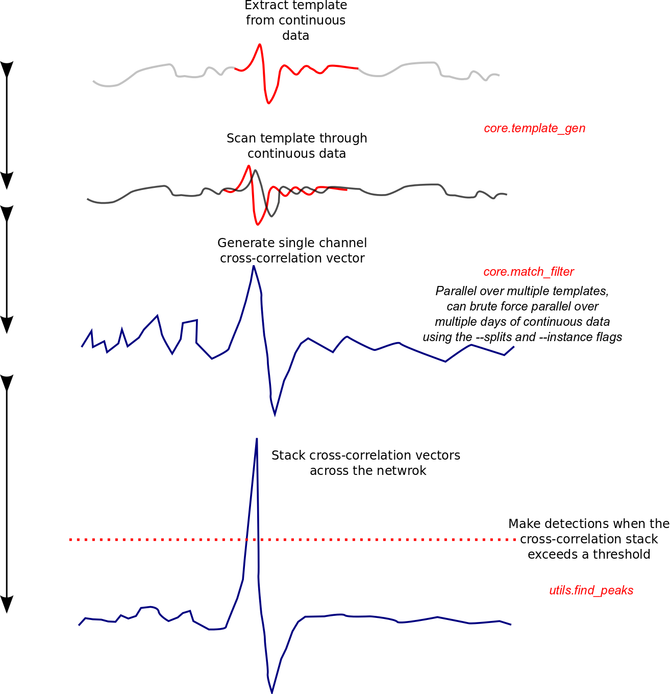

Matched-filter detection
========================

This tutorial will cover using both the match-filter objects, and using the
internal functions within match-filter.  The match-filter objects are designed
to simplify meta-data handling allowing for shorter code with fewer mistakes and
therefore more consistent results.

Match-filter objects
--------------------

The match-filter module contains five objects:

 - :doc:`Tribe </submodules/core.match_filter.Tribe>`
 - :doc:`Template </submodules/core.match_filter.Template>`
 - :doc:`Party </submodules/core.match_filter.Party>`
 - :doc:`Family </submodules/core.match_filter.Family>`
 - :doc:`Detection </submodules/core.match_filter.Detection>`

The :doc:`Tribe </submodules/core.match_filter.Tribe>` object is a container for
multiple :doc:`Template </submodules/core.match_filter.Template>` objects.
:doc:`Templates </submodules/core.match_filter.Template>` contain the waveforms
of the template alongside the metadata used to generate the template.  Both
:doc:`Templates </submodules/core.match_filter.Template>` and
:doc:`Tribes </submodules/core.match_filter.Tribe>` can be written to disk as
tar archives containing the waveform data in miniseed format, event catalogues
associated with the :doc:`Templates </submodules/core.match_filter.Template>`
(if provided) in quakeml format and meta-data in a csv file.  This archives
can be read back in or transferred between machines.

The :doc:`Detection </submodules/core.match_filter.Detection>`,
:doc:`Family </submodules/core.match_filter.Family>` and
:doc:`Party </submodules/core.match_filter.Party>` objects are heirachical,
a single :doc:`Detection </submodules/core.match_filter.Detection>` object
describes a single event detection, and contains information regarding how
the detection was made, what time it was made at alongside other useful
information, it does not store the
:doc:`Template </submodules/core.match_filter.Template>` object used for the
detection, but does store a reference to the name of the
:doc:`Template </submodules/core.match_filter.Template>`.
:doc:`Family </submodules/core.match_filter.Family>` objects are containers
for multiple :doc:`Detections </submodules/core.match_filter.Detection>` made
using a single :doc:`Template </submodules/core.match_filter.Template>`
(name chosen to match the literature).  These objects do contain the
:doc:`Template </submodules/core.match_filter.Template>` used for the detections,
and as such can be used to re-create the list of detections is necessary.
:doc:`Party </submodules/core.match_filter.Party>` objects are containers for
multiple :doc:`Family </submodules/core.match_filter.Family>` objects.  All
objects in the detection heirachy have read and write methods - we recommend
writing to tar archives (default) for Party and Family objects, as this will
store all metadata used in detection, which should allow for straightforward
reproduction of results.

Template creation
-----------------

:doc:`Templates </submodules/core.match_filter.Template>` have a construct
method which accesses the functions in
:doc:`template_gen </submodules/core.template_gen>`.  Template.construct
only has access to methods that work on individual events, and not catalogs; for
that use the Tribe.construct method. For example, we can use the *from_sac*
method to make a Template from a series of SAC files associated with a single
event:

.. code-block:: python

     >>> import glob
     >>> from eqcorrscan.core.match_filter import Template
     >>> sac_files = glob.glob('eqcorrscan/tests/test_data/SAC/2014p611252/*')
     >>> # sac_files is now a list of all the SAC files for event id:2014p611252
     >>> template = Template().construct(
     ...      method='from_sac', name='test', lowcut=2.0, highcut=8.0,
     ...      samp_rate=20.0, filt_order=4, prepick=0.1, swin='all',
     ...      length=2.0, sac_files=sac_files)

Tribe creation
--------------

As eluded to above, Template.construct only works for individual events, to
make a lot of templates we have to use the Tribe.construct method. The syntax
is similar, but we don't specify names - templates are named according
to their start-time, but you can rename them later if you wish:

.. code-block:: python

     >>> from eqcorrscan.core.match_filter import Tribe
     >>> from obspy.clients.fdsn import Client

     >>> client = Client('NCEDC')
     >>> catalog = client.get_events(eventid='72572665', includearrivals=True)
     >>> # To speed the example we have a catalog of one event, but you can have
     >>> # more, we are also only using the first five picks, again to speed the
     >>> # example.
     >>> catalog[0].picks = catalog[0].picks[0:5]
     >>> tribe = Tribe().construct(
     ...      method='from_client', catalog=catalog, client_id='NCEDC', lowcut=2.0,
     ...      highcut=8.0,  samp_rate=20.0, filt_order=4, length=6.0, prepick=0.1,
     ...      swin='all', process_len=3600, all_horiz=True)
     Pre-processing data

Matched-filter detection using a Tribe
--------------------------------------

Both Tribe and Template objects have *detect* methods.  These methods call
the main match_filter function.  They can be given an un-processed stream and
will complete the appropriate processing using the same processing values stored
in the Template objects.  Because Tribe objects can contain Templates with a
range of processing values, this work is completed in groups for groups of
Templates with the same processing values.  The Tribe object also has a
client_detect method which will download the appropriate data.  Both *detect*
and *client_detect* methods return Party objects.

For example, we can use the Tribe we created above to detect through a day of
data by running the following:

.. code-block:: python

     >>> from obspy import UTCDateTime

     >>> party, stream = tribe.client_detect(
     ...      client=client, starttime=UTCDateTime(2016, 1, 2),
     ...      endtime=UTCDateTime(2016, 1, 3), threshold=8, threshold_type='MAD',
     ...      trig_int=6, plotvar=False, return_stream=True)

Lag-calc using a Party
----------------------

Because parties contain Detection and Template information they can be used to
generate re-picked catalogues using lag-calc:

.. code-block:: python

     >>> stream = stream.merge().sort(['station'])
     >>> repicked_catalog = party.lag_calc(stream, pre_processed=False,
     ...                                   shift_len=0.2, min_cc=0.4) # doctest:+ELLIPSIS
     5 Trace(s) in Stream:...

By using the above examples you can go from a standard catalog available from
data centers, to a matched-filter detected and cross-correlation repicked
catalog in a handful of lines.

Simple example - match-filter.match-filter
------------------------------------------

This example does not work out of the box, you will have to have your own templates
and data, and set things up for this.  However, in principle matched-filtering
can be as simple as:

.. code-block:: python

     from eqcorrscan.core import match_filter
     from eqcorrscan.utils import pre_processing
     from obspy import read

     # Read in and process the daylong data
     st = read('continuous_data')
     # Use the same filtering and sampling parameters as your template!
     st = pre_processing.dayproc(st, lowcut=2, highcut=10, filt_order=4,
                                 samp_rate=50,
                                 starttime=st[0].stats.starttime.date)
     # Read in the templates
     templates = []
     template_names = ['template_1', 'template_2']
     for template_file in template_names:
          templates.append(read(template_file))
     detections = match_filter.match_filter(
          template_names=template_names, template_list=templates, st=st,
          threshold=8, threshold_type='MAD', trig_int=6, plotvar=False, cores=4)

This will create a list of detections, which are of class detection.  You can
write out the detections to a csv (colon separated) using the detection.write
method, set `append=True` to write all the detections to one file.  Beware though,
if this is set and the file already exists, it will just add on to the old file.

.. code-block:: python

     for detection in detections:
          detection.write('my_first_detections.csv', append=True)

Memory limitations and what to do about it
------------------------------------------

You may (if you are running large numbers of templates, long data durations, or using
a machine with small memory) run in to errors to do with memory consumption. The
most obvious symptom of this is your computer freezing because it has allocated
all of its RAM, or declaring that it cannot allocate memory.  Because EQcorrscan
computes correlations in parallel for multiple templates for the same data period,
it will generate a large number of correlation vectors.  At start-up, EQcorrscan
will try to assign the memory it needs (although it then requires a little more
later to do the summation across channels), so you might find that it fills your
memory very early - this is just to increase efficiency and ensure that the memory
is available when needed.

To get around memory limitations you can:

* Reduce the number of templates you run in parallel at once - for example you can
  make groups of a number of templates and run that group in parallel, before running
  the next group in parallel.  This is not much less efficient, unless you have
  a machine with more CPU cores than your group-size.
* Reduce the length of data you are correlating at any one time.  The default is
  to use day-long files, but there is nothing stopping you using shorter waveform
  durations.
* Reduce the number of channels in templates to only those that you need.  Note,
  EQcorrscan will generate vectors of zeros for templates that are missing a
  channel that is present in other templates, again for processing efficiency,
  if not memory efficiency.
* Reduce your sampling rate.  Obviously this needs to be at-least twice as large
  as your upper frequency filter, but much above this is wasted data.

As an example of this: we run 100, 5-channel templates sampled at 20 Hz through
day-long data on a 128GB RAM machine without issue, however, running 200 templates
is too much memory.

The three threshold parameters
------------------------------

The match-filter routine has three key threshold parameters:

* **threshold_type** can either be MAD, abs or av_chan_corr.  MAD stands for Median Absolute
  Deviation and is the most commonly used detection statistic in matched-filter studies.
  abs is the absolute cross-channel correlation sum, note that if you have different
  numbers of channels in your templates then this threshold metric probably isn't for you.
  av_chan_corr sets a threshold in the cross-channel correlation sum based on av_chan_corr x number of channels.
* **threshold** is the value used for the above metric.
* **trig_int** is the minimum interval in seconds for a detection using the same template.
  If there are multiple detections within this window for a single template then EQcorrscan
  will only give the best one (that exceeds the threshold the most).

Advanced example - match-filter-match-filter
--------------------------------------------

In this section we will outline using the templates generated in the first tutorial
to scan for similar earthquakes within a day of data.  This small example does not truly exploit the parallel
operations within this package however, so you would be encouraged to think
about where parallel operations occur (*hint, the code can run one template
per CPU*), and why there are --instance and--splits flags in the other
scripts in the github repository (*hint, if you have heaps of memory
and CPUs you can do some brute force day parallelisation!*).

The main processing flow is outlined in the figure below, note the main speedups
in this process are achieved by running multiple templates at once, however this
increases memory usage.  If memory is a problem there are flags (mem_issue) in the
match_filter.py source that can be turned on - the codes will then write temporary
files, which is slower, but can allow for more data crunching at once, your trade-off,
your call.

.. literalinclude:: ../../tutorials/match_filter.py

SLURM example
-------------

When the authors of EQcorrscan work on large projects, we use grid computers with
the SLURM (Simple Linux Utility for Resource Management) job scheduler installed.
To facilitate ease of setup, what follows is an example of how we run this.

.. code-block:: bash

     #!/bin/bash
     #SBATCH -J MatchTest
     #SBATCH -A ##########
     #SBATCH --time=12:00:00
     #SBATCH --mem=7G
     #SBATCH --nodes=1
     #SBATCH --output=matchout_%a.txt
     #SBATCH --error=matcherr_%a.txt
     #SBATCH --cpus-per-task=16
     #SBATCH --array=0-49

     # Load the required modules here.
     module load OpenCV/2.4.9-intel-2015a
     module load ObsPy/0.10.3rc1-intel-2015a-Python-2.7.9
     module load joblib/0.8.4-intel-2015a-Python-2.7.9

     # Run your python script using srun
     srun python2.7 LFEsearch.py --splits 50 --instance $SLURM_ARRAY_TASK_ID

Where we use a script (LFEsearch.py) that accepts splits and instance flags,
this section of the script is as follows:

.. code-block:: python

     Split=False
     instance=False
     if len(sys.argv) == 2:
         flag=str(sys.argv[1])
         if flag == '--debug':
             Test=True
             Prep=False
         elif flag == '--debug-prep':
             Test=False
             Prep=True
         else:
             raise ValueError("I don't recognise the argument, I only know --debug and --debug-prep")
     elif len(sys.argv) == 5:
         # Arguments to allow the code to be run in multiple instances
         Split=True
         Test=False
         Prep=False
         args=sys.argv[1:len(sys.argv)]
         for i in xrange(len(args)):
             if args[i] == '--instance':
                 instance=int(args[i+1])
                 print 'I will run this for instance '+str(instance)
             elif args[i] == '--splits':
                 splits=int(args[i+1])
                 print 'I will divide the days into '+str(splits)+' chunks'

     elif not len(sys.argv) == 1:
         raise ValueError("I only take one argument, no arguments, or two flags with arguments")
     else:
         Test=False
         Prep=False
         Split=False

The full script is not included in EQcorrscan, but is available on request.

